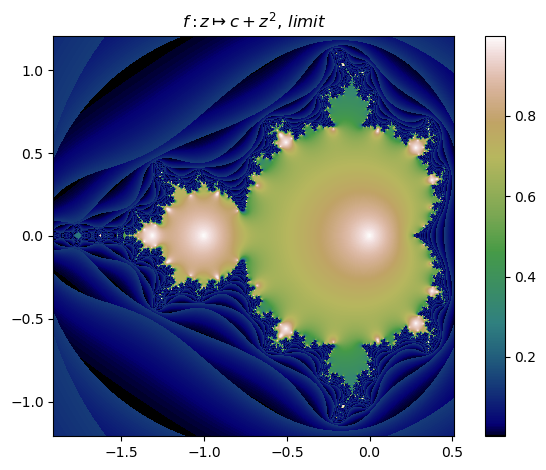
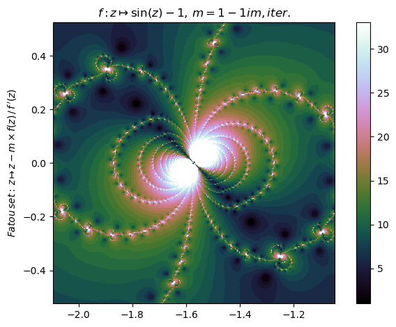

# Fatou.jl

[](https://travis-ci.org/chakravala/Fatou.jl) [](https://ci.appveyor.com/project/chakravala/fatou-jl) [](https://coveralls.io/github/chakravala/Fatou.jl?branch=master) [](http://codecov.io/github/chakravala/Fatou.jl?branch=master)

Julia package for Fatou sets. Install using `Pkg.add("Fatou")` in Julia. See [Explore Fatou sets & Fractals](https://github.com/chakravala/Fatou.jl/wiki/Explore-Fatou-sets-&-fractals) in Wiki for detailed *examples*. This package provides: `fatou`, `juliafill`, `mandelbrot`, `newton`, `basin`, `plot`, and `orbit`; along with various internal functionality using `Reduce` and Julia expressions to help compute `Fatou.FilledSet` efficiently. Full documentation is included. The `fatou` function can be applied to a `Fatou.Define` object to produce a `Fatou.FilledSet`, which can then be passed as an argument to the `plot` function of `PyPlot`. Creation of `Fatou.Define` objects is done via passing a `parse`-able function expression string (in variables `z`, `c`) and optional keyword arguments to `juliafill`, `mandelbrot`, and `newton`.

## Background

This package enables users of Julia lang to easily generate, explore, and share fractals of Julia, Mandelbrot, and Newton type. The name Fatou comes from the mathematician after whom the Fatou sets are named. Note that the Julia language is not named after the mathematician Julia after whom the Julia sets are named. This is a mere coincidence.

**Definition** *(Julia set)*: For any holomorphic function on a complex plane, the boundary of the set of points whose result diverges when the function is iteratively evaluated at each point.

**Definition** *(Fatou set)*: The Julia set’s complement is the set of fixed limit points from holomorphic recursion.

**Definition** *(Mandelbrot set)*: The set of points on a complex parameter space for which the holomorphic recursion does not go to infinity from a common starting point `z0`.

**Definition** *(Newton fractal)*: The Julia/Fatou set obtained from the recursion of the Newton method `z↦z−m⋅f(z)/f′(z)` applied to a holomorphic function.

The package has essentially two different plotting modes controlled by the `iter` boolean keyword, which toggles whether to color the image by iteration count or whether to use a default (or custom) limit-value coloring function.

The number of Julia threads available is detected at the startup and is reported it back. When a specified Fatou set is computed, multi-threading is used to compute the pixels.
Since each pixel is independent of any other pixel, it doesn’t matter in what order or on how many threads it is computed, the more you use the faster it is.
The environment variable `JULIA_NUM_THREADS` can be used to enable the multi-threading for more than 1 thread.

Please share your favorite fractals as `Fatou` snippet in the [discussion thread](https://discourse.julialang.org/t/ann-fatou-jl-easily-share-julia-fractals)!

## Launching `Fatou` on Julia 1.0.1

Note that `Fatou` is not compatible with Julia 1.0 but works on Julia 1.0.1 alright. At the moment, a stackoverflow error occurs on Julia 1.0.1 when `using Fatou`, which can be avoided by `using Reduce,Fatou` instead.
If you encounter an unsatisfiable requirement in the package manager, an easy workaround is to use `dev Fatou` instead of `add Fatou`.

## Basic Usage

A Fatou set is a collection of complex valued orbits of an iterated function. To help illustrate this, an additional feature is a plot function designed to visualize real-valued-orbits. The following is a cobweb orbit plot of a function:

```Julia
juliafill(:(z^2-0.67),∂=[-1.25,1.5],x0=1.25,orbit=17,depth=3,n=147) |> orbit
```


With `fatou` and `plot` it is simple to display a filled in Julia set:

```Julia
c = -0.06 + 0.67im
nf = juliafill(:(z^2+$c),∂=[-1.5,1.5,-1,1],N=80,n=1501,cmap="gnuplot",iter=true)
plot(fatou(nf), bare=true)
```


It is also possible to switch to `mandelbrot` mode:

```Julia
mandelbrot(:(z^2+c),n=800,N=20,∂=[-1.91,0.51,-1.21,1.21],cmap="gist_earth") |> fatou |> plot
```



`Fatou` also provides `basin` to display the the Newton / Fatou basins using set notation in LaTeX in `IJulia`.

```Julia
map(display,[basin(newton(:(z^3-1)),i) for i ∈ 1:3])
```

%20=%20\left\\{z\in\mathbb{C}:\left|\\,z%20-%20\frac{z^{3}%20-%201}{3%20z^{2}}%20-%20r_i\\,\right|%3C\epsilon,\\,\forall%20r_i(\\,f(r_i)=0%20)\right\\})

%20=%20\left\\{z\in\mathbb{C}:\left|\\,z%20-%20\frac{\left(z%20-%20\frac{z^{3}%20-%201}{3%20z^{2}}\right)^{3}%20-%201}{3%20\left(z%20-%20\frac{z^{3}%20-%201}{3%20z^{2}}\right)^{2}}%20-%20\frac{z^{3}%20-%201}{3%20z^{2}}%20-%20r_i\\,\right|%3C\epsilon,\\,\forall%20r_i(\\,f(r_i)=0%20)\right\\})

%20=%20\left\\{z\in\mathbb{C}:\left|\\,z%20-%20\frac{\left(z%20-%20\frac{\left(z%20-%20\frac{z^{3}%20-%201}{3%20z^{2}}\right)^{3}%20-%201}{3%20\left(z%20-%20\frac{z^{3}%20-%201}{3%20z^{2}}\right)^{2}}%20-%20\frac{z^{3}%20-%201}{3%20z^{2}}\right)^{3}%20-%201}{3%20\left(z%20-%20\frac{\left(z%20-%20\frac{z^{3}%20-%201}{3%20z^{2}}\right)^{3}%20-%201}{3%20\left(z%20-%20\frac{z^{3}%20-%201}{3%20z^{2}}\right)^{2}}%20-%20\frac{z^{3}%20-%201}{3%20z^{2}}\right)^{2}}%20-%20\frac{\left(z%20-%20\frac{z^{3}%20-%201}{3%20z^{2}}\right)^{3}%20-%201}{3%20\left(z%20-%20\frac{z^{3}%20-%201}{3%20z^{2}}\right)^{2}}%20-%20\frac{z^{3}%20-%201}{3%20z^{2}}%20-%20r_i\\,\right|%3C\epsilon,\\,\forall%20r_i(\\,f(r_i)=0%20)\right\\})

Compute the Newton fractal Julia set for a function with annotated plot of iteration count:

```Julia
nf = newton(:(z^3-1),n=800,ϵ=0.1,N=25,iter=true,cmap="jet")
nf |> fatou |> plot
basin(nf,3)
```


Generalized Newton fractal example:

```Julia
nf = newton(:(sin(z)-1),m=1-1im,∂=[-2π/3,-π/3,-π/6,π/6],n=500,N=33,iter=true,ϵ=0.05,cmap="cubehelix")
nf |> fatou |> plot
basin(nf,2)
```



%20=%20\left\\{z\in\mathbb{C}:\left|\\,z%20-%20\frac{1}{\cos{\left%20(z%20\right%20)}}%20\left(1%20+%20i\right)%20\left(\sin{\left%20(z%20\right%20)}%20-%201\right)%20-%20\frac{\left(1%20+%20i\right)%20\left(\sin{\left%20(z%20-%20\frac{1}{\cos{\left%20(z%20\right%20)}}%20\left(1%20+%20i\right)%20\left(\sin{\left%20(z%20\right%20)}%20-%201\right)%20\right%20)}%20-%201\right)}{\cos{\left%20(z%20-%20\frac{1}{\cos{\left%20(z%20\right%20)}}%20\left(1%20+%20i\right)%20\left(\sin{\left%20(z%20\right%20)}%20-%201\right)%20\right%20)}}%20-%20r_i\\,\right|%3C\epsilon,\\,\forall%20r_i(\\,f(r_i)=0%20)\right\\})

## Detailed Explanation

View [Explore Fatou sets & Fractals](https://github.com/chakravala/Fatou.jl/wiki/Explore-Fatou-sets-&-fractals) in Wiki for detailed *examples*.
